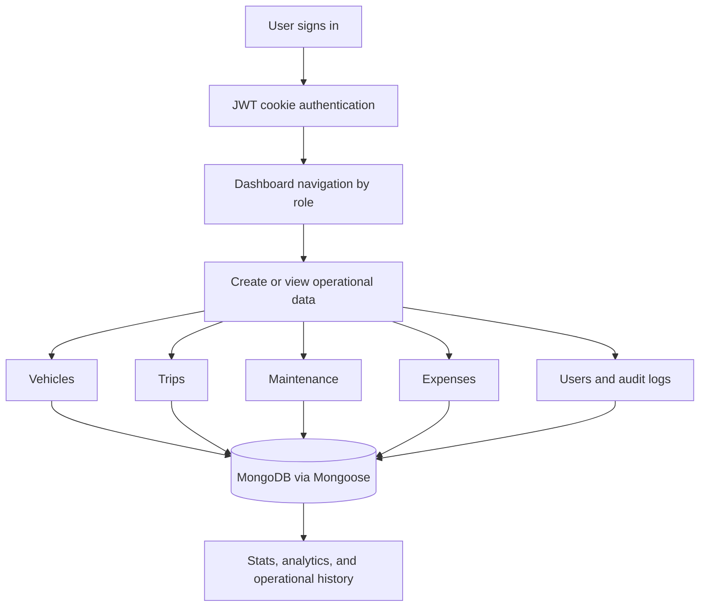
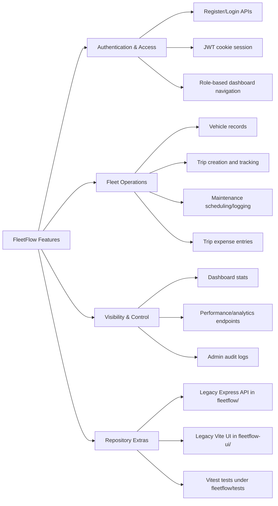

# FleetFlow

FleetFlow is a fleet operations project for managing vehicles, trips, maintenance, expenses, users, and audit logs from one dashboard.

## Overview
This repository currently contains:
- A **Next.js + TypeScript** application (root `app/`, `lib/`, `components/`) with API routes and dashboard UI.
- A separate **Express + Prisma** backend in `fleetflow/` and a **Vite React** UI in `fleetflow-ui/`.

The README below focuses on what is actually present in this repository today.

## Why this project was made (motivation)
Fleet and logistics teams often run operations across spreadsheets, calls, and disconnected tools. That creates common issues like delayed dispatching, weak cost visibility, and missed maintenance tracking.

FleetFlow was made to provide one place to:
- manage vehicles and trips,
- control access by role,
- track maintenance and trip expenses,
- and keep an audit trail of operational actions.

## Who this project helps
FleetFlow is useful for:
- **Fleet owners and managers**: track operational status and utilization quickly.
- **Dispatchers**: create and monitor trips with vehicle/driver context.
- **Operations teams (maintenance/accounting)**: track service records and trip expenses.
- **Developers/startups**: use a practical codebase for building fleet-management workflows.

## What problem this project solves
### Problem statement
Daily fleet operations involve multiple moving parts (vehicle availability, trip assignment, maintenance timing, and cost tracking). Without a centralized workflow, teams can lose visibility and make avoidable coordination errors.

### Solution summary
FleetFlow combines dashboard pages with API routes for core workflows: authentication, role-based access, vehicle and trip records, maintenance records, expense entries, analytics endpoints, and audit logs.

## Project flow diagram (root Next.js app)
This flow describes the root `app/` + `lib/` implementation.  
The separate `fleetflow/` module uses Express + Prisma + PostgreSQL.



## Feature diagram


## Key features in current codebase
- JWT authentication (`app/api/auth/*`) and protected API access.
- Role model covering `admin`, `dispatcher`, `driver`, `mechanic`, `accountant`, and `viewer`.
- Fleet modules via API routes:
  - `app/api/vehicles/route.ts`
  - `app/api/trips/route.ts`
  - `app/api/maintenance/route.ts`
  - `app/api/expenses/route.ts`
  - `app/api/analytics/route.ts`
  - `app/api/performance/route.ts`
  - `app/api/dashboard/stats/route.ts`
- Admin management and audit trails (`app/api/admin/*`).
- Dashboard pages for vehicles, trips, maintenance, trip expenses, performance, analytics, users, and audit logs (`app/dashboard/*`).

## Tech stack
### Root app
- Next.js (App Router)
- React + TypeScript
- Tailwind CSS + shadcn/ui components
- MongoDB + Mongoose
- JWT + bcryptjs

### Additional modules in repository
- `fleetflow/`: Node.js + Express + Prisma + PostgreSQL + Vitest
- `fleetflow-ui/`: React + Vite + ESLint

## Setup (root Next.js app)
1. Clone repository:
   ```bash
   git clone https://github.com/mittal122/FleetFlow-odoo-.git
   cd FleetFlow-odoo-
   ```
2. Install dependencies:
   ```bash
   npm install
   ```
3. Create environment file (example values):
   ```bash
   MONGODB_URL=mongodb://localhost:27017/fleetflow
   JWT_SECRET=change-this-secret
   ```
   Use a `MONGODB_URL` that matches your runtime:
   - Host machine (`npm run dev` locally): `mongodb://localhost:27017/fleetflow`
   - Docker Desktop setups (common): `mongodb://host.docker.internal:27017/fleetflow`
   - Linux Docker setups (common): `mongodb://172.17.0.1:27017/fleetflow` or your host IP
4. Start development server:
   ```bash
   npm run dev
   ```
5. Open: `http://localhost:3000`

## Usage notes
- Register a user or sign in through `/login`.
- API routes are under `/api/*`.
- A seed endpoint exists at `POST /api/seed` to create demo users for all roles (admin, dispatcher, driver, mechanic, accountant, viewer).
  Role-specific capabilities differ by page/module, so some roles have narrower workflows than admin.
  ```bash
  curl -X POST http://localhost:3000/api/seed
  ```
  Expected response includes a `results` array with per-role status such as `created` or `already exists`.  
  This users-only seed endpoint checks existing emails and skips already-created users on re-run.
  ```json
  {
    "success": true,
    "message": "Seed complete",
    "data": {
      "results": [
        "admin: created",
        "dispatcher: already exists"
      ]
    }
  }
  ```

## Optional: run tests in the Express module
If you also want to run the `fleetflow/` module tests:
```bash
cd fleetflow
npm install
npm test
```

## Future improvements
- Add a single, unified architecture path (root app vs legacy modules).
- Add CI checks for README/Markdown and end-to-end smoke tests.
- Add deployment-specific guides (local, Docker, and cloud) for each module.

## Contributing
Contributions are welcome. Please open an issue first to discuss major changes.

## License
Please ensure an appropriate `LICENSE` file is in place before production use.
